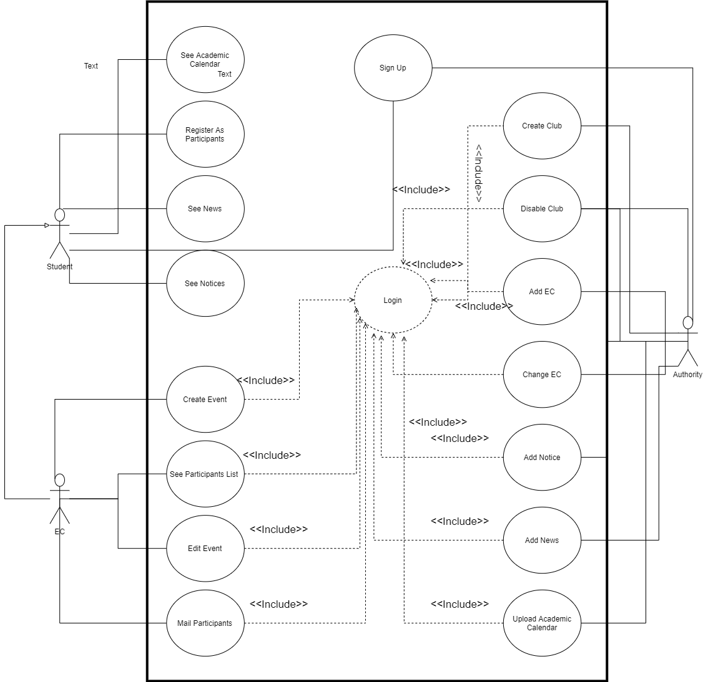
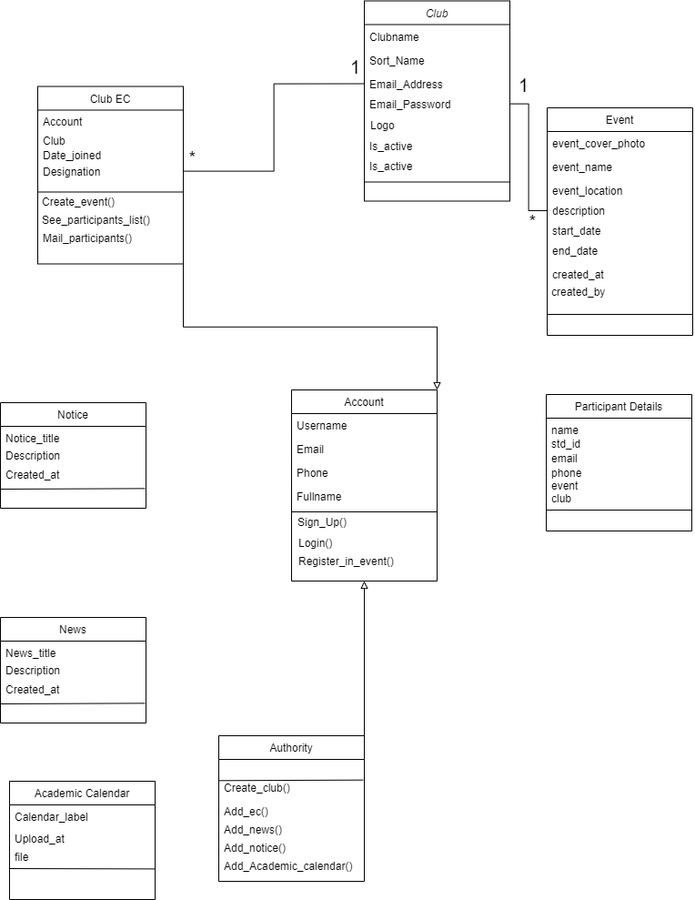

<h1>Event Management System</h1>

<h2>1. Introduction</h2>

<h3><u>1.1 Purpose</u></h3>

The main purpose of this project is to create a platform where university students can find all events of their university and know the updated news and notices from one place and the organizer of the events can manage the student’s information who were participating in their past events.

<h3><u>1.2 Product Scope</u></h3>

This product is designed for university or any kind of educational institute where their clubs arrange many educational events many times.

<h2>2. Overall Description</h2>

<h3><u>2.1 Product Perspective</u></h3>

The perspective of this product is to create a platform where students can easily find themselves interested events which are arranged by many clubs of their university and find updated news and notices published by their university.

<h3><u>2.2 Product Functions</u></h3>
<h3>Functional Requirements:</h3>
<ol>
	<li>
	The system will have five kind of user.
		<ul>
			<li>Students</li>
			<li>Clubs</li>
			<li>Main admin or university authority</li>
		</ul>
	</li>
	<li>
	The clubs can open an event in this system and manage the event through this system properly by following this way
	<ul>
		<li>They can create an event in this platform.</li>
		<li>They can take register of students who are interested to participate this event</li>
		<li>They can send SMS or mail to the students by using this system.</li>
		<li>They can manage all of student information by this system and they can download student information from this system.</li>
		<li>They can make certificate for the students through this system. For this we give some template of certificate. They need to use one of them for make certificate. They also print this certificate if this device where the system is running is connected to a printer.</li>
	</ul>
	</li>
	<li>Students can see all of the events and can also see the details of this event and they can register them for participating a particular event./li>
	<li>The main admin is university authority. They can create a club, add an executive member of a club, remove an executive from a club and update news and notices and academic calendar of the university.</li>

</ol>

<h3>Non-Functional Requirements:</h3>
<ol>
	<li>The system has strong security.</li>
	<li>The system manages all the student information squirrely and must verify the students who are come from a university who are form a particular university.</li>
	<li>The system manages the payment issues perfectly.</li>
	<li>The system is user friendly.</li>
</ol>
<h3>2.3 User Classes and Characteristics</h3>
There are three Character of use:
<ol>
	<li>University Students</li>
	<li>University Club</li>
	<li>University Authority</li>
</ol>

<h3>2.4 Operating Environment</h3>

For accessing this system user need a modern browser of a PC, tab or mobile phone with any operating system.

<h2>Appendix A: Analysis Models:</h2>

<h3>Use Case Diagram</h3>

<h3>Class Diagram</h3>

